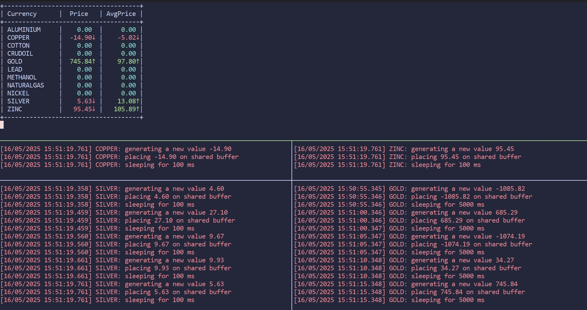

# Producer-Consumer Problem Simulation

This project simulates the stock commodities market using the classic producer-consumer problem. Producers generate random prices for commodities and place them in a shared buffer, while consumers read these prices, calculate averages, and display the data in a tabular format.

## Features

- **Producers**: Simulate stock price generation for various commodities.
- **Consumers**: Process and display the stock prices, along with their average trends.
- **Shared Memory**: Used for communication between producers and consumers.
- **Semaphores**: Ensure synchronization and mutual exclusion.

## Practical Example

The simulation models a stock commodities market where producers generate prices for commodities like GOLD, SILVER, CRUDOIL, etc., and consumers analyze these prices to track trends.



## How to Run

1. **Compile the Code**:
   ```bash
   mkdir build && cd build && cmake -S .. -B . && cmake --build .
   ```

2. **Run the Consumer**:
   Start the consumer process with the buffer size as an argument:
   ```bash
   ./consumer 100
   ```

3. **Run the Producer**:
   Start the producer process with the following arguments:
   ```bash
   ./producer <commodity_name> <mean_price> <std_dev> <sleep_time_ms> <buffer_size>
   ```
   Example:
   ```bash
   ./producer GOLD 1800 50 1000 100
   ```

4. **Observe the Output**:
   The consumer will display a table of commodity prices and their trends in real-time.

## Project Structure

- **`include/`**: Contains header files for shared memory, queue, and message structures.
- **`examples/`**: Contains example implementations of producer and consumer.
- **`docs/`**: Contains documentation and example images.

## Requirements

- C++ compiler
- cmake
- make
- POSIX shared memory and semaphore support

## Notes

- The buffer size should not exceed the defined `SHARED_MEM_SIZE` (default: 100).
- Ensure proper cleanup of shared memory and semaphores by terminating the processes gracefully (e.g., using `Ctrl+C`).

## License

This project is licensed under the MIT License.
